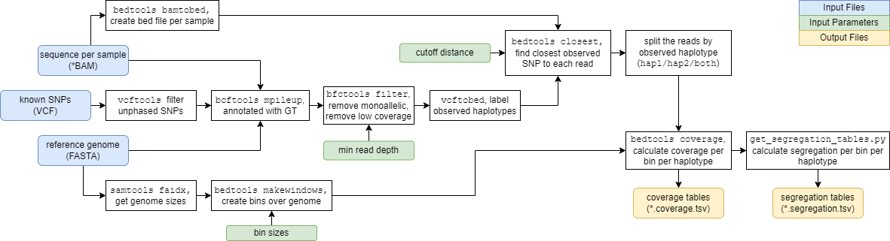

# Pipeline-Cophasing (PCP) #

Nextflow-based pipeline for cophasing of GAM reads.

## Pipeline

### Input:
1. GAM experiemt samples in the BAM format,
2. Reference genome in the FASTA format,
3. **Phased** SNPs the in the VCF format.

### Output
A set of tables of the form `{genome_name}.{bin_size}.{hap}.coverage.tsv` and `{genome_name}.{bin_size}.{hap}.segregation.tsv` for different bin sizes with the number of reads per bin per `sample`. Haplotype `hap` is either `hap1`, `hap2`, or `both`.  The columns are:
1. `chrom`: chromosome name
2. `start`: start position of the bin
3. `stop`: the stop position of the bin
4. `[sample]`: The number of reads in the bin for `coverage.tsv`, and 1 or 0 for `segregation.tsv`, with 1 meaning the bin has been determined to be covered after filtering, 0 the opposite.

**Note**: For segregation, only autosomes are considered. The filter requires that the chromosomes are named in either the UCSC (chr1-chr22) or Ensembl format (1-22).

### Process

#### Align reads to the reference haplotype
1. filter out positions without phasing information
2. convert VCF to BED format
3. find the closest snip for each read and merge

#### Create bins
1. bin the genome into fixed sized, non-overlapping windows of desired resolution, eg 50kb, 100kb, 200kb 

#### Calculat coverage 
1. for comparison, calculate the coverage of each window using the original unsplit GAM samples,
2. calculate coverage files of all split GAM samples for each haplotype,
3. combine coverage files of all samples into one coverage table, per resolution

The coverated table describes the number of **bases** covered by reads in each window, therefore it is possible that the sum of coverage from both haplotypes is higher than the total number of bases covered in a window, as some bases may be covered by both haplotypes.

#### Segregation
The segregation algorithm removes spurious bins in particular the following two steps:
1. Finds a separation threshold for bin count to remove noise reads.
2. Remove orphan bins (bins with no neighbours).

## Requirements:
Use the provided conda environment file `pcp-env.yaml` to install all the required software.

## Execution

To execure run:

`nextflow run pipeline-cophasing.nf [parameters]`

### Output

By default the results are written to the `./out` folder.

### Test run

Random testing data are provided as a part of the package. Run the following command to test the pipeline:

`nextflow run pipeline-cophasing.nf -c test_data.config` 

**NOTE:** The parameters for the execution are stored in the Nextflow configuration file `test_data.config`.

### Parameters

#### Mandatory
* `--fa path` reference file either as `.fa`  or `.fa.gz`.
* `--bam path` alignment files either as `.bam` or `.sam`. This can be a glob pattern (e.g. `sample*.bam`). All files matching the pattern are used then.
*  `--vcf path` variant call files either as `.vcf` or `.vcf.gz`. Must contain phased GT information.

**Note**: GATK requires `.gz` files to be compressed with `bgzip`, not `gzip`.

#### Default 
* `--name string` the prefix that will be given to the samples, `default=<the name of the reference file>`,
* `--bins [int]` the bin sizes to be used, `default=[50000, 100000, 200000]`,
* `--out path` a path to a folder where the output is stored, `default=./out`,
* `--min_depth int` a minimum read depth per SNP to be included `default=1`,
* `--cutoff int` maximum distance from a read to a closest so that the read is still matched to the SNP `default=0`,

### Visualization

A sample visualization method is shown in the notebook `NMPI_matrix_vis.ipynb`. This notebook loads a singular segregation table and plots a contact map for one chromosome in a specified region. 

## Authors
This pipeline has been developed at Max Delbrück Center for Molecular Medicine, Berlin. Authors:

* Dr. Adam Streck: pipeline development,
* Dr. Julia Markowski: creator of the co-phasing method,
* Dr. Alexander Kukalev: creator of the separation algorithm.

## Contact
Email questions, feature requests and bug reports to **Adam Streck, adam.streck@mdc-berlin.de**.

## License
Pipeline-Cophasing is available under the MIT License. 
